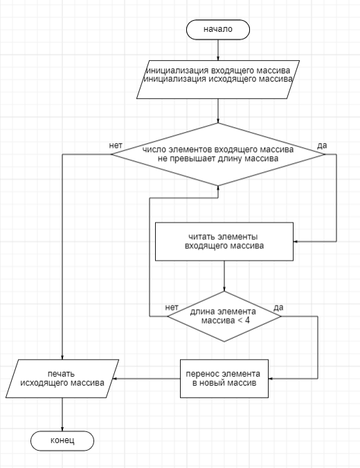

# Итоговая проверочная работа

## Задача:
 Написать программу, которая из имеющегося массива строк формирует новый массив из строк, длина которых меньше, либо равна 3 символам. Первоначальный массив можно ввести с клавиатуры, либо задать на старте выполнения алгоритма. При решении не рекомендуется пользоваться коллекциями, лучше обойтись исключительно массивами.

**Примеры:**
*[“Hello”, “2”, “world”, “:-)”] → [“2”, “:-)”]
[“1234”, “1567”, “-2”, “computer science”] → [“-2”]
[“Russia”, “Denmark”, “Kazan”] → []*

## Алгоритм решения
1. Ввод данных с клавиатуры с помощью метода FillingArr для задания     первоначального массива
2. Создание нового массива из строк, длина которых меньше, либо равна 3 символам. Метод CreatNewArr
3. Проверка нового массива на наличие элементов
4. Перенс данных в новый массив. Метод TransferNewElements
5. Вывод на печать элементов заданного и нового сформированного массивов. Меетод PrintArray

## Приложение
Блок-схема

    

